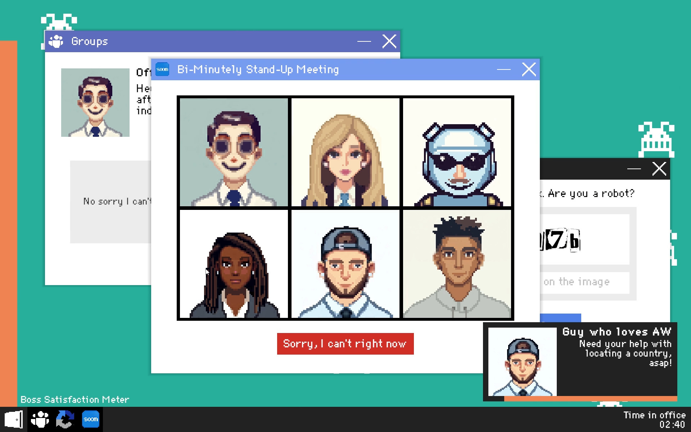
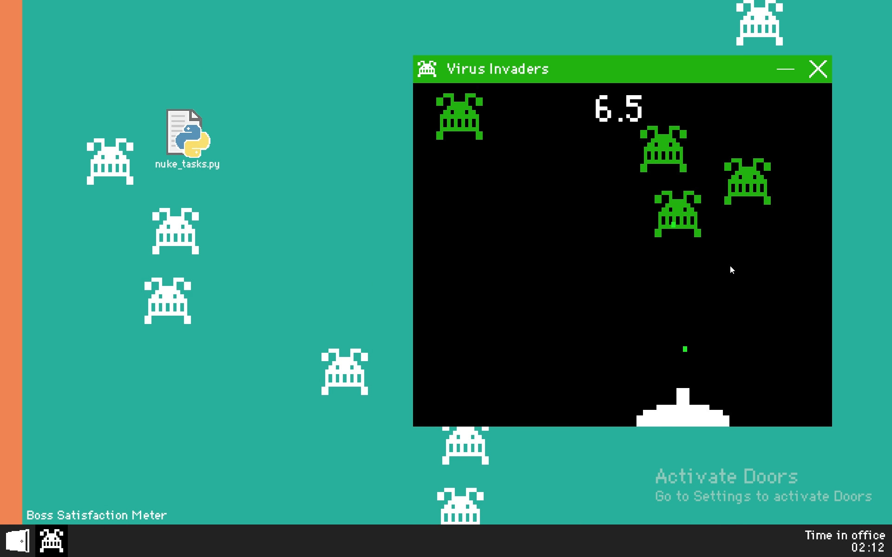
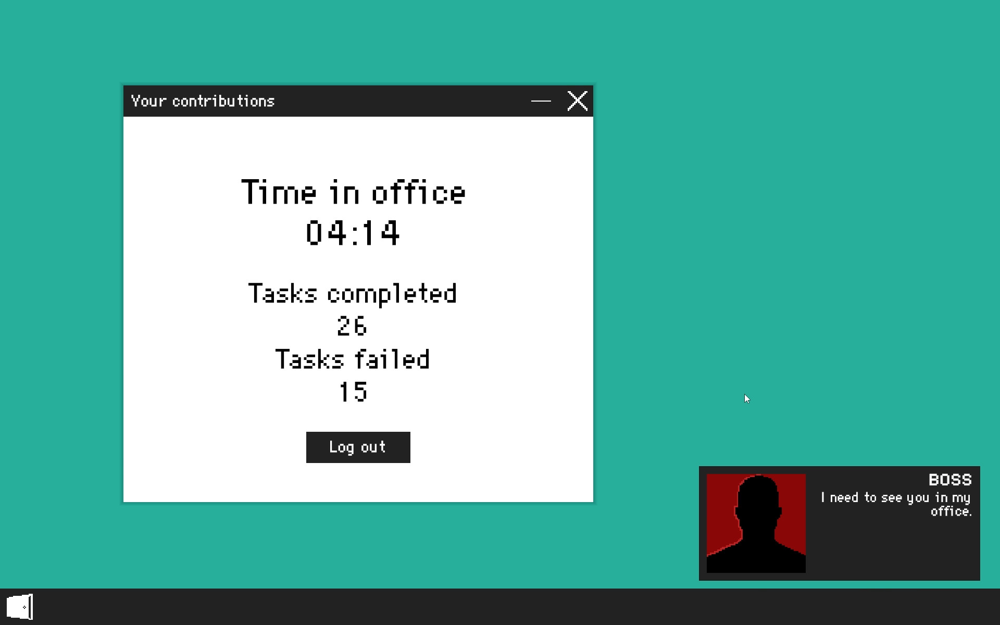
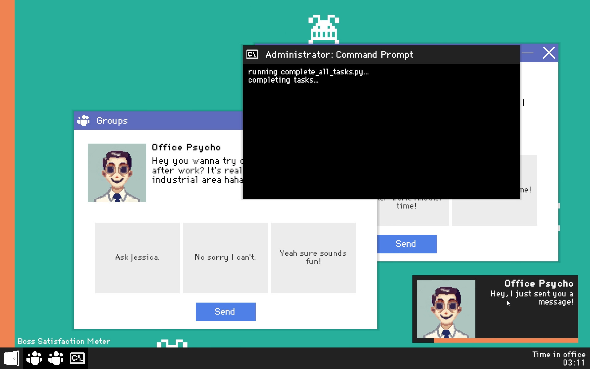
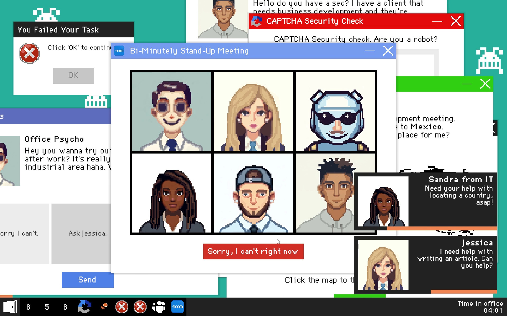
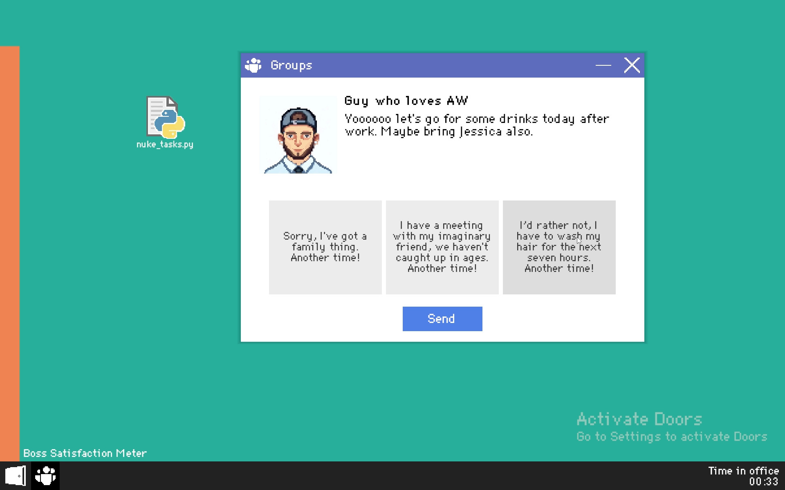
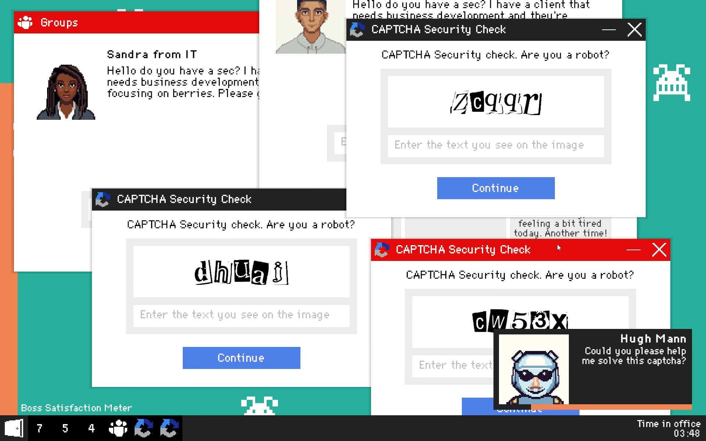

# Don't Get Summoned!
A desktop sim game made by me and Freja Ling during a weekend for Ludum Dare 55 with the theme "Summoning"

### Links

- [Play on itch.io](https://busisen.itch.io/dont-get-summoned)
- [Ludum Dare Entry](https://ldjam.com/events/ludum-dare/55/dont-get-summoned)

## About

You work at your 9-5 office job, and while your colleagues are pleasant enough, you want as little face time with them as possible. You may get summoned for meetings or social events with coworkers, but do your very best to avoid them whilst keeping their approval of you high and finishing your other tasks on time. Otherwise you will get called to your boss’ office and it’s game over for your minimum effort office tactics.

## Controls

- Mouse/keyboard

## Screenshots

